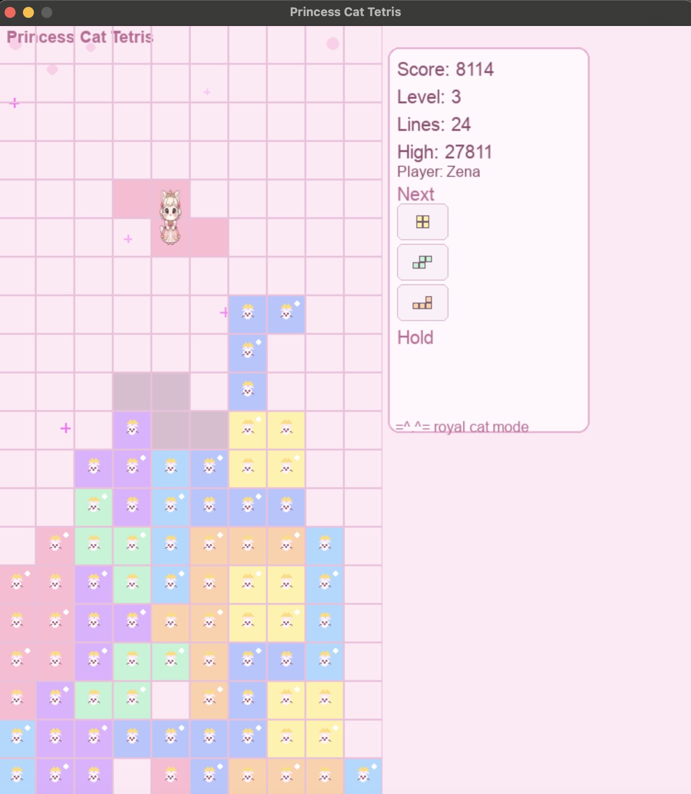

# Princess Cat Tetris 👑🐱

Princess Cat Tetris is a cat-themed Tetris-style game built in Python using `pygame-ce`. I created the project through AI-assisted prototyping in Cursor, then customized and iterated on the gameplay, visual theme, and player experience.



## Features

- Classic Tetris-style gameplay
- Princess cat-themed tetromino sprites
- Player name entry and high-score leaderboard
- Score and level progression
- Hold-piece functionality
- Ghost piece showing where the current piece will land
- Increasing fall speed as levels progress

## About the Project

I built this project as an experiment in using AI-assisted development to turn an idea into a functioning game. I used Cursor to help generate and refine the code while I directed the features, tested the game, customized the visuals, and iterated on the experience.

One feature I added was a named leaderboard so players can enter their name and save their score. I plan to continue improving the leaderboard and other gameplay features as I develop the project further.

## Running the Game

### Requirements

- Python 3
- `pygame-ce`

Install the project dependencies:

```bash
python3 -m pip install -r requirements.txt
```

Then run:

```bash
python3 run.py
```

## Tests

The project includes tests for several pieces of core game logic. Run them with:

```bash
python3 -m pytest -q
```

## Project Structure

- `game/` — game loop and game state
- `entities/` — tetromino models
- `systems/` — gameplay systems such as movement, collision, rotation, scoring, spawning, and holding pieces
- `rendering/` — game graphics and HUD
- `input/` — keyboard input handling
- `utils/` — shared constants and randomization helpers
- `tests/` — tests for core game logic

## Future Improvements

- Update the leaderboard so each player name keeps only their highest score
- Continue refining gameplay and visual details
- Add additional features as I become more familiar with the codebase